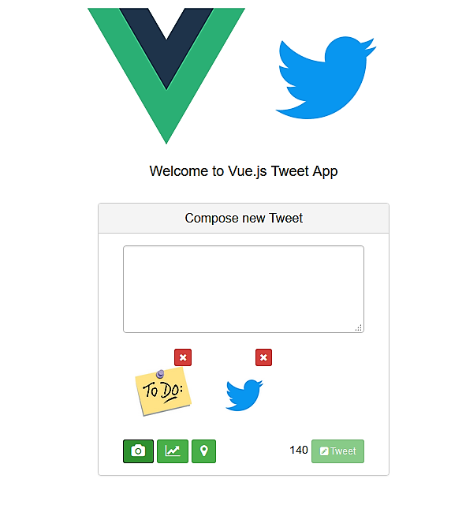

# Vuejs Tweet

> A simple Vue.js project which implements the tweet feature (some) using bootstrap and font-awesome.
<p align="center">
    
</p>

<p>
    The fetaures implemented are: 
    <ul>
        <li>Disabling tweet button when no character is typed.</li> 
        <li>Disabling tweet button when character limit is reached.</li> 
        <li>User can attach multiple pictures to tweet</li> 
        <li>User can delete attached pictures</li> 
    </ul>
</p>

<p>
    The fetaures to be implemented are: 
    <ul>
        <li>Check-in feature, denoted by location button.</li> 
        <li>The GIF feature.</li> 
        <li>The polls feature, denoted by the graph button.</li> 
    </ul>
</p>

> credit: <a href="https://medium.freecodecamp.com/vue-js-introduction-for-people-who-know-just-enough-jquery-to-get-by-eab5aa193d77" target="_blank"> vue-js-introduction-for-people-who-know-just-enough-jquery</a>

## Build Setup

``` bash
# install dependencies
npm install

# serve with hot reload at localhost:8080
npm run dev

# build for production with minification
npm run build

# build for production and view the bundle analyzer report
npm run build --report

# run unit tests
npm run unit

# run e2e tests
npm run e2e

# run all tests
npm test
```

For detailed explanation on how things work, checkout the [guide](http://vuejs-templates.github.io/webpack/) and [docs for vue-loader](http://vuejs.github.io/vue-loader).
